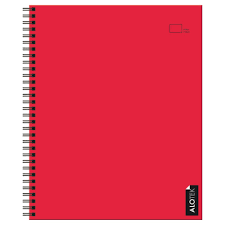
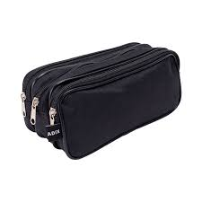

 <!DOCTYPE html>
<html lang="es">
<head>
  <meta charset="UTF-8">
  <meta name="viewport" content="width=device-width, initial-scale=1.0">
  <title>TUARSS - Tienda Escolar</title>
 
    
</head>

<body>

  

    <h1>TUARSS 🦖⛩️🛒</h1>
    
Tu tienda de útiles escolares al mejor precio

  

  <!-- carrito fuera de contenedores, fijo en la esquina -->
  

    🛒 0
  

</body>

  

    
    <h3>Set de lápices</h3>
    
$1.000 CLP

    <button onclick="agregarAlCarrito('Set de lápices')">Comprar producto</button>
  

  

    
    <h3>Cuaderno universitario</h3>
    
$1.500 CLP

    <button onclick="agregarAlCarrito('Cuaderno universitario')">Comprar producto</button>
  

  

    
    <h3>Mochila resistente</h3>
    
$15.000 CLP

    <button onclick="agregarAlCarrito('Mochila resistente')">Comprar producto</button>
  

  

    
    <h3>Goma de borrar</h3>
    
$300 CLP

    <button onclick="agregarAlCarrito('Goma de borrar')">Comprar producto</button>
  

  

    
    <h3>Regla 30 cm</h3>
    
$700 CLP

    <button onclick="agregarAlCarrito('Regla 30 cm')">Comprar producto</button>
  

  

    
    <h3>Corrector líquido</h3>
    
$1.200 CLP

    <button onclick="agregarAlCarrito('Corrector líquido')">Comprar producto</button>
  

  

    
    <h3>Sacapuntas</h3>
    
$600 CLP

    <button onclick="agregarAlCarrito('Sacapuntas')">Comprar producto</button>
  

  

    
    <h3>colores de palo</h3>
    
$2.500 CLP

    <button onclick="agregarAlCarrito('colores de palo')">Comprar producto</button>
  

  

    
    <h3>Estuche escolar</h3>
    
$3.000 CLP

    <button onclick="agregarAlCarrito('Estuche escolar')">Comprar producto</button>
  

  

    
    <h3>Set de destacadores</h3>
    
$2.000 CLP

    <button onclick="agregarAlCarrito('Set de resaltadores')">Comprar producto</button>
  

  

    
    <h3>Pega en barra</h3>
    
$800 CLP

    <button onclick="agregarAlCarrito('Pega en barra')">Comprar producto</button>
  

  

    
    <h3>Compás metálico</h3>
    
$1.800 CLP

    <button onclick="agregarAlCarrito('Compás metálico')">Comprar producto</button>
  

  

    
    <h3>Tijeras escolares</h3>
    
$900 CLP

    <button onclick="agregarAlCarrito('Tijeras escolares')">Comprar producto</button>
  

  

    
    <h3>Cartuchera con cierre</h3>
    
$3.200 CLP

    <button onclick="agregarAlCarrito('Cartuchera con cierre')">Comprar producto</button>
  

  

    
    <h3>Carpeta basica</h3>
    
$1.200 CLP

    <button onclick="agregarAlCarrito('Carpeta basica')">Comprar producto</button>
  

  

    
    <h3>Marcador permanente</h3>
    
$2.300 CLP

    <button onclick="agregarAlCarrito('Marcador permanente')">Comprar producto</button>
  

  

    
    <h3>lapiz mina</h3>
    
$800 CLP

    <button onclick="agregarAlCarrito('lapiz mina')">Comprar producto</button>
  

  

    
    <h3>block de dibujo</h3>
    
$1.500 CLP

    <button onclick="agregarAlCarrito('block de dibujo')">Comprar producto</button>
  

  

    
    <h3>Papel lustre</h3>
    
$600 CLP

    <button onclick="agregarAlCarrito('Papel lustre')">Comprar producto</button>
  

  

    
    <h3>Botella de plástico</h3>
    
$1.000 CLP

    <button onclick="agregarAlCarrito('Botella de plástico')">Comprar producto</button>
  

  
  
 <!-- cierre div productos -->

<!-- MODAL (CUADRO EMERGENTE) -->

  

    
쮸gregar producto al carrito?

    <button onclick="confirmarAgregar()" style="margin-right:10px;">Agregar al carrito</button>
    <button onclick="cerrarModal()">Cancelar</button>
  

<!-- Script -->

 </body>
</html>
